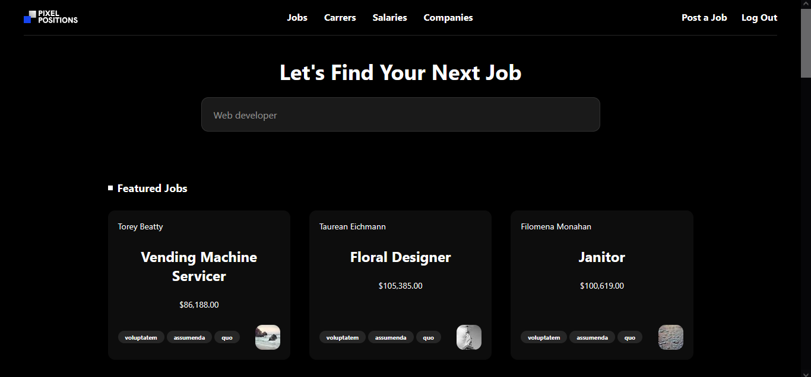
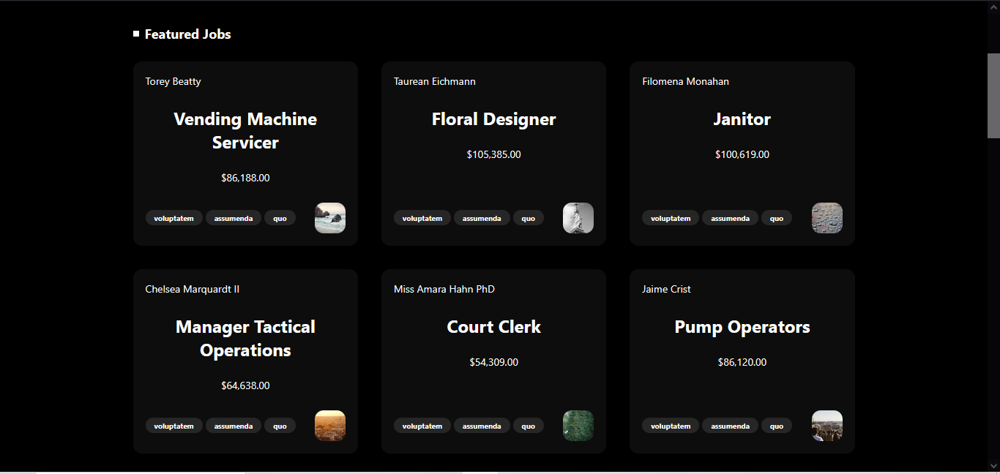

# 🧩 Pixel Positions

Pixel Positions is a simple and clean job portal built with Laravel. It allows users to:

-   Browse jobs without logging in.
-   Register and log in to post new job listings.
-   Add details such as title, salary, location, schedule, company URL, and tags.
-   Mark jobs as **Featured** or display as **Recent**.

---

## 🖥️ Dashboard

This is the main dashboard showing all job listings. It displays job titles, salaries, tags, and whether the job is recent or featured.



> **Image:** The dashboard view listing all jobs with their basic information and visual tags.

---

## ⭐ Featured Jobs

Jobs marked as "Featured" by employers are highlighted separately in a dedicated section.



> **Image:** A display of featured jobs that stand out with special emphasis on the dashboard.

---

## 📝 Post a Job

Authenticated users can use this form to post a job. The form includes fields for job details and customization options.


> **Image:** Job posting form where users can input title, salary, location, schedule, tags, and set it as featured.

---

## 🏷️ Tags & Recent Jobs

Tags help categorize jobs for better filtering and visibility. This section also highlights the most recently added jobs.


> **Image:** Display of jobs filtered by tags along with a list of recently posted jobs.

---

## ⚙️ Tech Stack

-   **Framework:** Laravel 10+
-   **Database:** SQLite (viewed using TablePlus)
-   **Frontend:** Blade + Tailwind CSS
-   **Markdown Tools:** VS Code for previewing this README locally

---

## 🛠️ Setup Instructions

1.  Clone the project:

    ```bash
    git clone https://github.com/khitab-khattak/pixel-positions
    cd pixel-positions

    ```

2.  Install PHP and JS dependencies:

    ```
    composer install
    npm install && npm run dev
    ```

3.  Configure .env:
    ```
    DB_CONNECTION=sqlite
    ```
4.  Create database and run migrations:
    ```
    touch database/database.sqlite
    php artisan migrate
    php artisan storage:link

        ```

5.  Start the server:
    ```
    php artisan serve
    npm run dev
    ```

